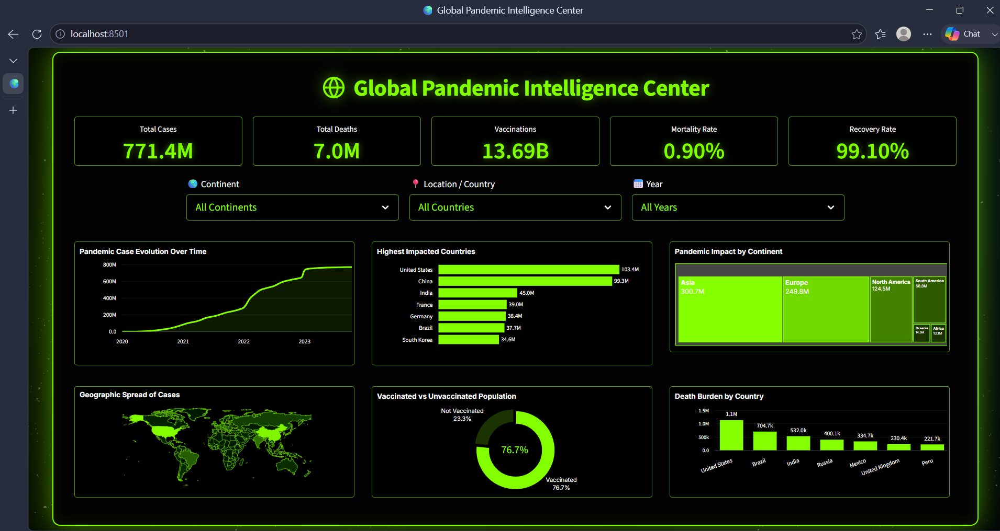

<div align="center">

# 🌍 Global Pandemic Intelligence Center

### A real-time, interactive pandemic analytics dashboard built with Streamlit & Plotly

[](https://www.python.org/)
[](https://streamlit.io/)
[](https://plotly.com/)
[](https://pandas.pydata.org/)
[](LICENSE)
[](https://pandemic-intelligence-dashboard.streamlit.app/)

**🔴 [Live Demo → pandemic-intelligence-dashboard.streamlit.app](https://pandemic-intelligence-dashboard.streamlit.app/)**



</div>

---

## 🔴 Live Demo

> ✨ Try the dashboard live — no installation needed!

**👉 [https://pandemic-intelligence-dashboard.streamlit.app/](https://pandemic-intelligence-dashboard.streamlit.app/)**

---

## 📖 Overview

The **Global Pandemic Intelligence Center** is an elegant, single-page analytics dashboard that transforms raw COVID-19 data into actionable visual insights. Built with a sleek **space-nebula dark aesthetic** — electric green on pure black — the dashboard gives you a complete pandemic overview at a glance: from global KPIs and trend lines to choropleth maps and continent-level breakdowns.

It is fully interactive: filter by **continent**, **country**, and **year** and every chart updates instantly.

---

## ✨ Features

| Feature | Description |
|---|---|
| 📊 **5 Real-time KPI Cards** | Total Cases, Total Deaths, Vaccinations, Mortality Rate, Recovery Rate |
| 📈 **Pandemic Case Evolution** | Smooth area-line chart showing cumulative case trajectory over time |
| 🏆 **Top 7 Impacted Countries** | Horizontal bar chart ranking highest-case countries |
| 🗺️ **Continent-wise Treemap** | Proportional area breakdown of pandemic impact by continent |
| 🌐 **Choropleth World Map** | Color-scaled geographic spread of total cases per country |
| 🍩 **Vaccination Doughnut** | Vaccinated vs Unvaccinated population split with center percentage |
| ⚰️ **Death Burden Bar Chart** | Top 7 countries by total deaths (vertical column chart) |
| 🔍 **3-Way Filtering** | Live filter by Continent → Country → Year with cascading logic |
| ⚡ **Cached Data Loading** | `@st.cache_data` for fast re-renders on filter changes |

---

## 🖥️ Dashboard Preview

<div align="center">

> **Dark Space-Nebula Theme** — Electric `#84FF00` neon-green accents on obsidian black, with glowing borders and subtle radial nebula background gradients.

</div>

The dashboard is designed as a **single-screen, no-scroll experience** — every chart and KPI fits inside one browser viewport for maximum clarity.

---

## 🗂️ Project Structure

```
Pandemic_Dashboard/
│
├── app.py                  # Main Streamlit application (all logic + styling)
├── requirements.txt        # Python dependencies
├── README.md               # This file
│
├── data/
│   └── corona_dataset.csv  # OWID COVID-19 dataset (~88 MB)
│
└── images/
    └── preview.png         # Dashboard screenshot
```

---

## 🚀 Getting Started

### Prerequisites

- Python **3.8+**
- pip

### 1. Clone the Repository

```bash
git clone https://github.com/sibi2904/Pandemic_Dashboard.git
cd Pandemic_Dashboard
```

### 2. Install Dependencies

```bash
pip install -r requirements.txt
```

### 3. Run the App

```bash
streamlit run app.py
```

The dashboard will open automatically in your browser at `http://localhost:8501`.

---

## 📦 Dependencies

```
streamlit
pandas
plotly
statsmodels
```

| Package | Purpose |
|---|---|
| `streamlit` | Web app framework & UI rendering |
| `pandas` | Data ingestion, cleaning, and aggregation |
| `plotly` | Interactive charts (line, bar, treemap, choropleth, pie) |
| `statsmodels` | Statistical utilities (required by plotly trendline features) |

---

## 📊 Data Source

The dashboard uses the [**Our World in Data (OWID)**](https://ourworldindata.org/coronavirus) COVID-19 dataset.

**Key columns used:**

| Column | Description |
|---|---|
| `iso_code` | 3-letter ISO country code (for choropleth) |
| `continent` | Continent grouping (used for filtering) |
| `location` | Country name |
| `date` | Date of record |
| `total_cases` | Cumulative confirmed cases |
| `total_deaths` | Cumulative confirmed deaths |
| `total_vaccinations` | Cumulative vaccine doses administered |
| `new_cases_smoothed` | 7-day rolling average of new cases |
| `population` | Country population (for vaccination rate calculation) |

> **Note:** OWID aggregate rows (World, Asia, Europe, etc.) are excluded — only country-level rows with a non-null `continent` are used.

---

## 🧠 How It Works

### Data Pipeline

```
corona_dataset.csv
       │
       ▼
  load_data()  ← @st.cache_data (loads once, reused across reruns)
       │
       ├─ Drop OWID aggregate rows (continent == NaN)
       ├─ Parse dates → datetime64
       ├─ Sort by [location, date]
       └─ Forward-fill cumulative columns within each country
```

### Filter Logic

Filters are stored in **Streamlit session state** (`sel_continent`, `sel_country`, `sel_year`) so they persist across reruns. The country dropdown cascades dynamically — when a continent is selected, only countries within that continent are shown.

### KPI Calculation

```python
latest     = last record per country (after filters)
total_cases    = sum of latest total_cases
total_deaths   = sum of latest total_deaths
total_vax      = sum of latest total_vaccinations
mortality      = total_deaths / total_cases × 100
recovery_rate  = (total_cases − total_deaths) / total_cases × 100
```

### Vaccination Coverage

Vaccination doses ÷ 2 (to approximate fully-vaccinated people), clipped to population, then expressed as a percentage of total filtered population.

---

## 🎨 Design System

| Token | Value | Usage |
|---|---|---|
| **Primary** | `#84FF00` | KPI values, chart lines, borders, accents |
| **Background** | `#000000` / `#020202` | App & card backgrounds |
| **Text** | `#FFFFFF` | Labels, axes, chart text |
| **Grid** | `rgba(132,255,0,0.1)` | Subtle chart gridlines |
| **Font** | `Inter` (Google Fonts) | All UI text |
| **Nebula BG** | Radial gradients at 15% & 85% | Space atmosphere |

---

## 📸 Charts at a Glance

| Chart | Type | Library |
|---|---|---|
| Pandemic Case Evolution Over Time | Area-line (spline) | `plotly.express.line` |
| Highest Impacted Countries | Horizontal bar | `plotly.express.bar` |
| Pandemic Impact by Continent | Treemap | `plotly.graph_objects.Treemap` |
| Geographic Spread of Cases | Choropleth map | `plotly.graph_objects.Choropleth` |
| Vaccinated vs Unvaccinated | Doughnut / Pie | `plotly.express.pie` |
| Death Burden by Country | Vertical bar | `plotly.graph_objects.Bar` |

---

## 🤝 Contributing

Contributions are welcome! Feel free to open an issue or submit a pull request for:

- 🐛 Bug fixes
- 📈 New chart types or metrics
- 🌍 Additional data sources
- 🎨 UI/UX improvements

---

## 👤 Author

**Sibi** — [@sibi2904](https://github.com/sibi2904)

---

## 📄 License

This project is licensed under the **MIT License** — see the [LICENSE](LICENSE) file for details.

---

<div align="center">

Made with ❤️ and ☕ using **Streamlit** + **Plotly**

⭐ **Star this repo if you found it useful!** ⭐

</div>
